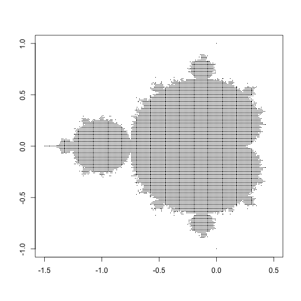

## Project

- This project provides a tool to plot the Mandelbrot set. 
- The function that constructs the set is adapted from http://users.utu.fi/attenka/mandelbrot_set.R. 
- The Mandelbrot set is the set of complex numbers c for which the function f(z)=z^2+c does not diverge when iterated from z=0 [https://en.wikipedia.org/wiki/Mandelbrot_set].

--- .class #id 

## Input parameters
The program admits four parameters: 
- Scale factor: It allows zooming in to see more in detail the boundary of the Mandelbrot set. 
- Center X: Changes the center of the plot in the x direction
- Center Y: Changes the center of the plot in the y direction
Center X and Y are most useful in combination with the scale factor to watch different parts of the set more in detail. 
- Maximun iterations: controls the maximum number of iterations done to decide if a point corresponds to the set or not.

--- .class #id 

## Mandelbrot set

--- .class #id 

## Conclusions
- The app allows to visualize the fractal structure of the Mandelbrot set.
- By zooming into the boundary of the set, the self-similar structures can be seen 
- The present code is not efficient. The server needs more than a minute to update the plot.

